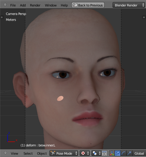

# Sophia Blender Animation API

This repository contains an animated model of the Sophia robot head, as a
[Blender file](https://www.blender.org/). This model is used to generate
motor movement commands for the physical robot, as well as to allow a
virtual display of the robot to be controlled (i.e. to look at it,
using blender).  To interact with it (either the real or the virtual robot)
you need the rest of the system, starting with the ROS node for this
model, which can be found in the 
[blender_api_msgs](https://github.com/hansonrobotics/blender_api_msgs) repo.

  

[More pretty pictures here](docs/eva2.md).

The ROS node is automatically started when the blender file is loaded.

The `rigControl` python module contains scripts to drive the model, as
well as defining a public programming API. The `rosrig` python module
(no longer in this repo) contains ROS node implementation. The `rigAPI` 
module defines an abstract base class for controlling the rig: the ROS 
node uses this API, and `rigControl` implements it.

# Running

Pre-requisites: The code is designed for Blender 2.71.
Start blender as follows:

```
blender -y Sophia.blend -P autostart.py
```

Sophia can be controlled via buttons in the blender GUI (note the panel
on the right).  A HOWTO guide for manipulating via ROS can be found in
the [Sophia cookbook](https://github.com/hansonrobotics/blender_api_msgs/blob/master/cookbook.md)


# Design


* The ROS node listens to and acts on ROS messages.  It uses the
  abstract base class `rigAPI` to communicate with blender.
* Animation messages are queued with the `CommandSource.py` module.
* The `CommandListener` listens to `CommandSource` messages; these
  are `'rigAPI` messages.
* The `command.py` module implements the `rigAPI`
* The `AnimationManager` keeps track of of Eva's internal state.
* The `Actuators` are responsible individual actions of Eva such as
  breathing, blinking and eye movement.

All animation sequences and 3D data are stored in the Blender file.

# Status
See the blender modernization work  describes in the
[graphics improvement project](docs/eva2.md).

# Copyright

Copyright (c) 2014,2015,2016 Hanson Robotics

Copyright (c) 2014,2015 Mike Pan
